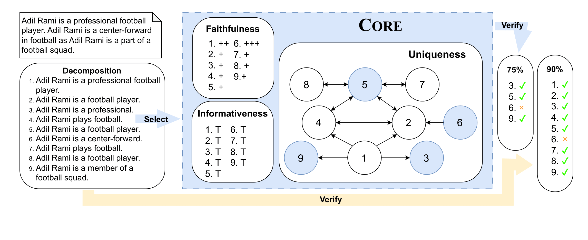

[](https://opensource.org/licenses/MIT)


# **Core**: Robust Factual Precision Scoring with Informative Sub-Claim Identification

This repository contains a minimalist implementation of the `core` package that can be used to subselect **unique** and **informative** subclaims from subclaims generated by some decomposer from a `Decompose-Then-Verify` pipeline. `core` is implemented thus that _it is orthogonal to most common improvements over `Decompose-Then-Verify` pipelines_, e.g. relevancy, checkworthiness etc.



### Requirements

- Python >= 3.10
- numpy
- scipy
- torch
- transformers

### Installation

```bash
pip install Core@git+https://git@github.com/zipJiang/Core.git
```

### Quick Start

The easiest way to use the `core` package is through the `Core` decorator. Suppose we have a decomposition function that looks something like this:

```python
def decompose(text: Text) -> List[Text]:
    ...
    return ["subclaim 1", "subclaim 2", "subclaim 3", ...]
```

You can simply create a filtered version of this function by adding the `Core` decorator:

```python
from core import Core

@Core()
def decompose(text: Text) -> List[Text]:
    ...
    return ["subclaim 1", "subclaim 2", "subclaim 3", ...]
```

Sometimes, the function is a little bit more complex than that. For example, the decomposer might return a tuple where only one entry is the subclaims. In this case, one can specify how the subclaims can be extracted, and hwo the new outputs can be constructed. For example:

```python
from core.utils.instances import DedupScorerInstance

@Core(
    result_parser=lambda result: [DedupScorerInstance(text=subclaim, sent=None, topic=None) for subclaim in result[1]],
    result_merger=lambda selected, inputs, result: (result[0], [ip.text for idx, ip in enumerate(inputs) if idx in selected])
)
def complex_decompose(text: Text) -> Tuple[Text, List[Text]]:
    ...
    return "some text", ["subclaim 1", "subclaim 2", "subclaim 3", ...]
```

`result_parser` should take the output of the decomposer and return a list of `DedupScorerInstance` objects (as defined in `core.utils.instances`). `result_merger` should take the selected indices, the inputs to the deduplication process of `Core` (a.k.a. the output of `result_parser`), and the output of the decomposer, and return a newly formatted output.

### Advanced Usage

The default deduplication configuration is pretty basic, where the weighting of all the subclaims is uniform. However, one can control the priority of the subclaims by specifying the weighting function through `sent_level_checkworthy_scorer` and `claim_level_checkworthy_scorer`. `sent_level_checkworthy_scorer` scores the sentence the subclaim is extracted from, and `claim_level_checkworthy_scorer` scores the subclaim itself. The default weighting function is equivalent to `lambda x: 1.0`, which assigns a uniform weight to all subclaims. For example, if we want to prioritize subclaims that are extracted from sentences that are longer than 10 words, we can do the following:

```python
from core.scorers import UNLIConfidenceBoostScorer
from core.entailers import SoftEntailer, Entailer

@Core(
    claim_level_checkworthy_scorer=UNLIConfidenceBoostScorer(
        bleached_templates=[
            "{topic} is a person.",
            "{topic} breathes."
            "{topic} exists."
            "{topic} is a name."
            "{topic} is unique."
            "{topic} is famous."
            "{topic} has some abilities."
            "somebody knows {topic}."
            "{topic} is a star."
        ],
        entailer=SoftEntailer(
            model_name="Zhengping/roberta-large-unli",
            device="cuda:0",
            internal_batch_size=256,
            max_length=256,
        ),
        cap_entailer=Entailer(
            model_name="ynie/roberta-large-snli_mnli_fever_anli_R1_R2_R3-nli",
            device="cuda:0",
            internal_batch_size=256,
            max_length=256,
        )
    ),
    score_combinator=lambda sent_score, claim_score: sent_score * claim_score - __EPSILON__
)
def decompose(text: Text) -> List[Text]:
    ...
    return ["subclaim 1", "subclaim 2", "subclaim 3", ...]
```

This will prioritize subclaims that are most surprising to the model.

The reason why we have to subclass `Scorer` to implement the weighting function is that it provides more flexibility of optimizing batch processing through a separeted function `_batch_score` that will be utilized by `Core`. By default, the batchification is done by the `Scorer` class automatically through repeatitive calls to `_score` function, which is not optimized for batch processing.

By default there are only the `ConstantScorer` and the `UNLIConfidenceBoostScorer` available through `core.scorers` to keep the package lightweight. However, one can easily implement their own `Scorer` by subclassing the `Scorer` class and implementing the `_score` and `_batch_score` functions. Notice that to use more complex scorers, one typically need to pass more information to the deduplicator (through `DedupScorerInstance`, or its subclasses).

The example above showcasing the default `score_combinator` function. The reason for the $-\epsilon$ in the end is to ensure that unhelpful subclaims are not selected (see the paper). The full list of parameters for `Core` is as follows:

```python

def Core(
    result_parser: Optional[Callable[[_R], List[DedupScorerInstance]]] = None,
    result_merger: Optional[Callable[[List[int], List[DedupScorerInstance], _R], _R]] = None,
    sentence_level_checkworthy_scorer: Optional[Scorer] = None,
    claim_level_checkworthy_scorer: Optional[Scorer] = None,
    score_combinator: Optional[Callable[[float, float], float]] = None,
    overwrite_entailer: Optional[Entailer] = None,
    silent: bool = False
):
    """Decorator factory for the Core deduplication algorithm. Add `@Core(...)` to your decomposition function with corresponding parameters to get a Core subselected decomposition.

    Parameters:
    -----------
    result_parser (Optional[Callable[[_R], List[CoreInstance]]): A function that takes the result and parse it into a list of `CoreInstance` that can be processed by Core.
    result_merger (Optional[Callable[[List[CoreInstance], _R], _R]): A function that takes the selected instances and merge it back to the original result.
    sentence_level_checkworthy_scorer (Optional[Scorer]): A scorer that scores the sentence level checkworthiness, defaults to `ConstantScorer(score=1.0)`.
    claim_level_checkworthy_scorer (Optional[Scorer]): A scorer that scores the claim level checkworthiness, defaults to `ConstantScorer(score=1.0)`.
    overwrite_entailer (Optional[Scorer]): A scorer that overwrites the default entailer, defaults to `None`, in this case, the default entailer is used which is NLI.
    silent: bool: Whether to print the progress information, defaults to `False` (to print).
    """
    ...
```

### Example Usage

For example of using the `core` package with the [FActScore](https://github.com/shmsw25/FActScore) decomposer, please refer to this notebook: [FActScore Example](https://colab.research.google.com/drive/1onaXjc53ucwdBUtfu0nEp9MF9DExzZb0?usp=sharing).
