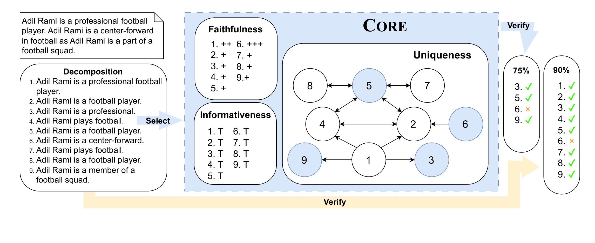

[](https://opensource.org/licenses/MIT)

# **Core**: Robust Factual Precision Scoring with Informative Sub-Claim Identification

`Core` is a lightweight, drop-in library for **selecting the most informative and non-redundant sub-claims** from a decomposition pipeline. It is designed to fit naturally into any `Decompose-Then-Verify` factuality-checking setup — sit between your decomposer and your verifier, and let Core decide which claims are worth checking.



---

## How It Works

Given a list of sub-claims produced by any decomposer, Core:

1. **Filters** claims not supported by the source sentence (entailment check).
2. **Scores** each claim for informativeness using configurable sentence-level and claim-level checkworthy scorers.
3. **Deduplicates** via a Mixed-Integer Linear Program (MILP) that selects the maximum-weight independent set of non-redundant claims — where redundancy is determined by pairwise entailment.

The result is a concise set of claims that are informative, non-redundant, and grounded in the source.

---

## Requirements

- Python ≥ 3.10
- `numpy`, `scipy`, `transformers`, `torch`
- `openai` (required for the vLLM backend; see below)

---

## Installation

```bash
pip install Core@git+https://git@github.com/zipJiang/Core.git
```

---

## Quick Start

The simplest way to use Core is as a decorator on your decomposition function:

```python
from core import Core

@Core()
def decompose(text: str) -> list[str]:
    ...
    return ["sub-claim 1", "sub-claim 2", "sub-claim 3", ...]
```

The decorated function returns a filtered list containing only the most informative, non-redundant sub-claims.

### Handling Complex Return Types

If your decomposer returns something more structured, use `result_parser` and `result_merger` to adapt:

```python
from core import Core
from core.utils.instances import DedupScorerInstance

@Core(
    result_parser=lambda result: [
        DedupScorerInstance(text=claim, sent=None, topic=None)
        for claim in result[1]
    ],
    result_merger=lambda selected, inputs, result: (
        result[0],
        [inputs[i].text for i in selected]
    )
)
def complex_decompose(text: str) -> tuple[str, list[str]]:
    ...
    return "some context", ["sub-claim 1", "sub-claim 2", ...]
```

- `result_parser` — converts your function's output into a list of `DedupScorerInstance` objects.
- `result_merger` — reconstructs the original return format from the selected indices.

---

## Advanced Usage: Checkworthy Scorers

By default, all claims are weighted equally. You can prioritize informative claims by providing custom scorers.

### Using `UNLIConfidenceBoostScorer` (local GPU models)

This scorer measures how *surprising* a claim is given only a topic context — claims that are harder to predict are weighted higher.

```python
from core import Core
from core.scorers import UNLIConfidenceBoostScorer
from core.entailers import SoftEntailer, Entailer

@Core(
    claim_level_checkworthy_scorer=UNLIConfidenceBoostScorer(
        bleached_templates=[
            "{topic} is a person.",
            "{topic} breathes.",
            "{topic} exists.",
            "{topic} is a name.",
            "{topic} is unique.",
            "{topic} is famous.",
            "{topic} has some abilities.",
            "somebody knows {topic}.",
            "{topic} is a star.",
        ],
        entailer=SoftEntailer(
            model_name="Zhengping/roberta-large-unli",
            device="cuda:0",
            internal_batch_size=256,
            max_length=256,
        ),
        cap_entailer=Entailer(
            model_name="ynie/roberta-large-snli_mnli_fever_anli_R1_R2_R3-nli",
            device="cuda:0",
            internal_batch_size=256,
            max_length=256,
        ),
    ),
)
def decompose(text: str) -> list[str]:
    ...
    return ["sub-claim 1", "sub-claim 2", ...]
```

---

## vLLM Backend for Large Models

For higher-quality entailment scoring — especially when using a large conditional-probability model — Core supports a **vLLM-backed entailer** via an OpenAI-compatible API. This is the recommended path when working with `Zhengping/conditional-probability-regression` or any similarly sized model that cannot run efficiently on local GPU memory.

### What is `VLLMSoftEntailer`?

`VLLMSoftEntailer` replaces the local transformer-based entailer with a **network call to a vLLM server**. Instead of running a classification model locally, it:

- Sends `(premise, hypothesis)` pairs to a vLLM-hosted model via the OpenAI chat completions API.
- Reads **log-probabilities** of special `<|label_level_N|>` tokens from the first generated token.
- Computes a **softmax-weighted average** over the label token scores, yielding a continuous probability in [0, 1].

All requests in a batch are dispatched **concurrently** using `asyncio.gather`, making it efficient even for large claim sets. Transient errors (connection failures, HTTP 429, 5xx) are automatically retried with exponential backoff via the `openai` client.

### Launching a vLLM Server

```bash
vllm serve Zhengping/conditional-probability-regression \
    --host 0.0.0.0 \
    --port 8000
```

> The model uses custom `<|label_level_N|>` tokens — make sure the correct tokenizer/config is loaded from the HuggingFace checkpoint.

### Using `VLLMSoftEntailer` in Core

```python
from core import Core
from core.entailers import VLLMSoftEntailer

vllm_entailer = VLLMSoftEntailer(
    model_name="Zhengping/conditional-probability-regression",
    api_base="http://localhost:8000/v1",  # your vLLM server
    num_labels=10,                         # number of label-level tokens
    internal_batch_size=32,
    top_logprobs=20,
    api_key="EMPTY",                       # vLLM default; set if your server requires auth
    max_retries=3,
    timeout=60.0,
)

@Core(overwrite_entailer=vllm_entailer)
def decompose(text: str) -> list[str]:
    ...
    return ["sub-claim 1", "sub-claim 2", ...]
```

You can also use `VLLMSoftEntailer` inside `UNLIConfidenceBoostScorer` as the underlying soft entailer — just pass it as the `entailer` argument.

### `VLLMSoftEntailer` Parameters

| Parameter             | Type    | Default                        | Description                                                               |
|-----------------------|---------|--------------------------------|---------------------------------------------------------------------------|
| `model_name`          | `str`   | —                              | Model name as registered in your vLLM server.                             |
| `api_base`            | `str`   | `"http://localhost:8000/v1"`   | Base URL of the vLLM OpenAI-compatible API.                               |
| `num_labels`          | `int`   | `10`                           | Number of `<|label_level_N|>` tokens in the model vocabulary.             |
| `internal_batch_size` | `int`   | `16`                           | Batch size for paginating requests.                                       |
| `top_logprobs`        | `int`   | `20`                           | Number of top logprobs to request from the API (must be ≥ `num_labels`).  |
| `api_key`             | `str`   | `"EMPTY"`                      | API key (use `"EMPTY"` for unauthenticated local vLLM servers).           |
| `max_retries`         | `int`   | `3`                            | Max retries on transient errors.                                          |
| `timeout`             | `float` | `60.0`                         | Per-request timeout in seconds.                                           |

### When to Use vLLM vs Local Models

| Scenario                                        | Recommended Entailer          |
|-------------------------------------------------|-------------------------------|
| Small/medium models on local GPU                | `Entailer` or `SoftEntailer`  |
| Large conditional-probability regression models | `VLLMSoftEntailer`            |
| Multi-GPU or multi-node inference               | `VLLMSoftEntailer`            |
| No GPU available locally                        | `VLLMSoftEntailer` (remote)   |
| Offline / air-gapped environment                | `Entailer` or `SoftEntailer`  |

---

## Full `Core` API Reference

```python
Core(
    result_parser=None,
    result_merger=None,
    sentence_level_checkworthy_scorer=None,
    claim_level_checkworthy_scorer=None,
    score_combinator=None,
    overwrite_entailer=None,
    cache_dir=None,
    silent=True,
)
```

| Parameter                         | Type                                         | Default                        | Description                                                                                       |
|-----------------------------------|----------------------------------------------|--------------------------------|---------------------------------------------------------------------------------------------------|
| `result_parser`                   | `Callable[[R], List[CoreInstance]]`          | parse `List[str]`              | Converts the decomposer output into `CoreInstance` objects for deduplication.                     |
| `result_merger`                   | `Callable[[List[int], List[CoreInstance], R], R]` | return selected strings   | Reconstructs the final output from selected indices.                                              |
| `sentence_level_checkworthy_scorer` | `Scorer`                                   | `ConstantScorer(1.0)`          | Scores sentences from which claims are extracted.                                                 |
| `claim_level_checkworthy_scorer`  | `Scorer`                                     | `ConstantScorer(1.0)`          | Scores individual claims for informativeness.                                                     |
| `score_combinator`                | `Callable[[float, float], float]`            | `a * b - ε`                    | Combines sentence and claim scores into a single weight for the MILP.                             |
| `overwrite_entailer`              | `Entailer`                                   | RoBERTa NLI model              | Replaces the default entailer. Use `VLLMSoftEntailer` for large-model inference.                  |
| `cache_dir`                       | `str`                                        | `None`                         | If set, caches entailment scores to disk to speed up repeated runs.                               |
| `silent`                          | `bool`                                       | `True`                         | Suppress progress output.                                                                         |

---

## Entailment Caching

For repeated runs over the same claim set, you can enable disk-based caching of entailment scores:

```python
@Core(cache_dir="/path/to/cache")
def decompose(text: str) -> list[str]:
    ...
```

This stores `(premise, hypothesis, model_name) → score` entries and skips re-computation on subsequent calls.

---

## Implementing Custom Scorers

Subclass `Scorer` and implement `_score` (and optionally `_batch_score` for efficiency):

```python
from core.scorers.scorer import Scorer
from core.utils.instances import ScorerInstance
from typing import Dict, Union, List

class MyScorer(Scorer):
    def _score(self, instance: ScorerInstance, silent: bool = False) -> Dict[str, Union[str, float]]:
        # Return a dict with at least a "parsed" key containing the float score
        return {"parsed": my_scoring_logic(instance.text)}

    def _batch_score(self, instances: List[ScorerInstance], silent: bool = False):
        # Optional: override for batched efficiency
        return [self._score(inst) for inst in instances]
```

---

## Example: FActScore Integration

For an end-to-end example using Core with the [FActScore](https://github.com/shmsw25/FActScore) decomposer, see this Colab notebook: [FActScore + Core Example](https://colab.research.google.com/drive/1onaXjc53ucwdBUtfu0nEp9MF9DExzZb0?usp=sharing).

---

## Citation

If you use this package in your research, please cite:

```bibtex
@misc{jiang2024corerobustfactualprecision,
      title={Core: Robust Factual Precision with Informative Sub-Claim Identification}, 
      author={Zhengping Jiang and Jingyu Zhang and Nathaniel Weir and Seth Ebner and Miriam Wanner and Kate Sanders and Daniel Khashabi and Anqi Liu and Benjamin Van Durme},
      year={2024},
      eprint={2407.03572},
      archivePrefix={arXiv},
      primaryClass={cs.CL},
      url={https://arxiv.org/abs/2407.03572}, 
}
```
